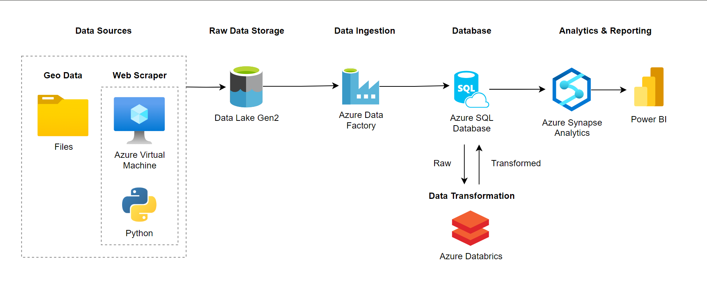
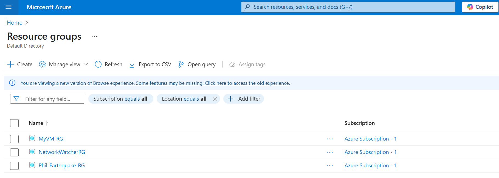
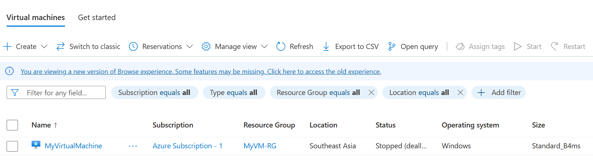
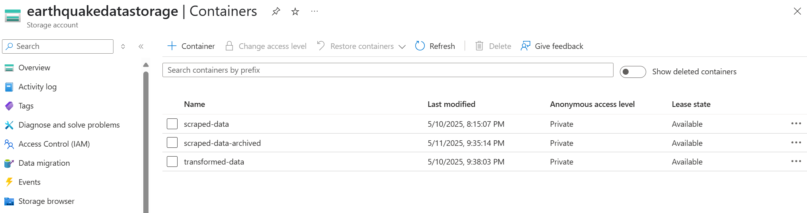
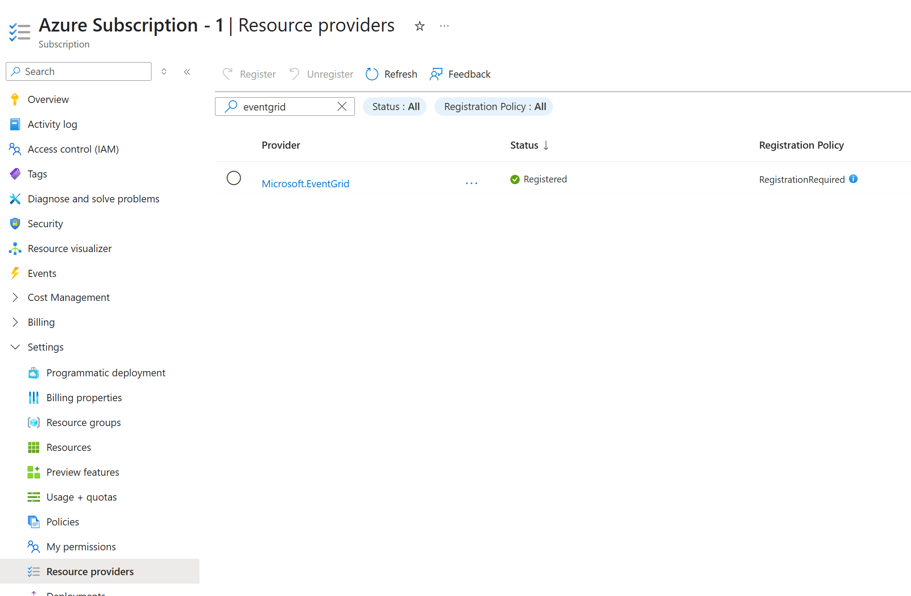

# 🚀 Philippine Earthquake Monitoring

> This project aims to have a monitoring tool using **Power BI** to visualize the previous and recent earthquakes in the Philippines.

---
## ✨ Tech Stack (Services) used in Build this Tool
- **Python** (Web Scraper & Geo Data Processing)
- **Azure Storage** (Raw Data Storage)
- **Azure Virtual Machine** (Deployed Web Scraper Environment)
- **Azure Data Factory** (Ingestion)
- **Azure SQL Database** (Structured Data Storage)
- **Azure Databrics** (Data Transformation)
- **Azure Synapse Analytics** (Analystics Data)
- **Power BI** (Visualization)



---


## 📂 App Folder Structure
<pre><code>
Root Repository
│
├── Database Script
│       ├── database
│       │       ├── __init__.py
│       │       ├── db_manager.py
│       │       └── queries.py
│       └── utils
│               ├── __init__.py
│               └── populate_table_widgets.py
│
├── Web Scraper
│       ├── main.py                     ← main app
│       ├── requirements.txt            ← python dependencies
│       ├── modules
│       │       ├── __init__.py
│       │       ├── DBConnect.py
│       │       ├── Logger.py
│       │       ├── Azure.py
│       │       ├── db_config.json      ← database credentials (hidden)
│       │       └── azure_config.json   ← azure cloud secret keys (hidden)
│       └── logs                        ← log files (.txt files)
│
├── documents
│                        
└── README.md

</code></pre>

--- 

## Microsoft Azure Cloud Services
- Resource Group


### 1. Azure Virtual Machine
The virtual machine is used to deploy the web scaper of this app.

- #### Web Scraper 🔗 [Wiki](https://github.com/jeevr/Phil-Earthquake-Monitoring/wiki/Web-Scraper)

    The web sraper is built using Python language.
    - **Purpose:** Scrape data from this url ``https://earthquake.phivolcs.dost.gov.ph/`` for the Earthquake data points which occurs daily
    - **Deployed Scraping Frequency:** Daily
    - **VM Specs (Size):** Standard B4ms (4 vcpus, 16 GiB memory)
    - **VM Specs (OS):** Windows
    - **Output :** CSV file of the scraped data
    


### 2. Azure Data Lake Gen2
The Data Lake is where the raw data are stored. Inlcuding the scraped data from the web scraper.




### 3. Azure Data Factory
Is used for data ingestion which fetch data from Azure Data Lake and dumps the raw data into Azure SQL Database.

- Reads raw data from Azure Data Lake container ``scraped-data`` which is trigged via ``Event`` in Blob Storage 
    - **Note:** Make sure your **Event.Grid** is **Registered** under your **Subscription**
    
- Identifies which records are not yet in the SQL Database
- Dumps the identified data into Azure SQL Database
- Moves the raw data into ``scraped-data-archive``


### 4. Azure SQL Database
Stores data which where dumped by the Azure Data Factory
- ### Initial Set-up
    - Create Table


### 5. Azure Databrics
> Further data processing and transformation and dumps back the transformed data into Azure SQL Database.

### 6. Azure Synapse Analytics

### 7. Power BI

---

## 🔧 Clone Repository

### 1. Virtual Environment
> **Command Prompt** 

- **Create:** ``python -m venv venv_AppOne``
- **Activate:** ``venv_AppOne\Scripts\activate``
- **Deactivate:** ``deactivate``
- **Freezing App Dependencies (Libraries):** ``pip freeze > requirements.txt ``
- **Installing Libraries from Requirements.txt:** ``pip install -r requirements.txt``

### 2a. Accessing QS Designer
> **QS Designer** is part of the Library **PySide6** and automatically downloaded during pip install.

To find the **QS Designer**, navigate to this directory:
```C:\Users\Lenovo\AppData\Local\Programs\Python\Python311\Lib\site-packages\PySide6``` and file the green app **Designer.exe**

You can create a shortcut for ease of access next time.


### 2b. Generating .py files  from QS Designer
- **Run:** ``pyside6-uic <qs designer file>.ui -o ui/<output file>.py``
- **Sample:** ``pyside6-uic page_one.ui -o ui/page_one_ui.py``

### 2c. Generating .py files for Images/Icons needed for QSS
- **Make a file named:** ``resources.qrc``
- **Edit in Text Editor/notepad:** 
    ```bash
    <RCC>
        <qresource prefix="/">
            <file>icons/arrow_down.png</file>
            <file>styles/style.qss</file>
        </qresource>
    </RCC>
    ```
- **The `<file>` paths are relative to the .qrc file location**
- **The `<prefix>` sets the virtual folder (often /)**
- **Use the pyside6-rcc or pyrcc6 tool to convert it to Python:** ``pyside6-rcc resources.qrc -o resources_rc.py``
- **This generates a resources_rc.py file that you import in your Python code.**
- **Import the compiled file:** `import resources_rc`

### 3. Executing the App (via Editor)
> **VSCode**
- **Run:** ``python main.py``
